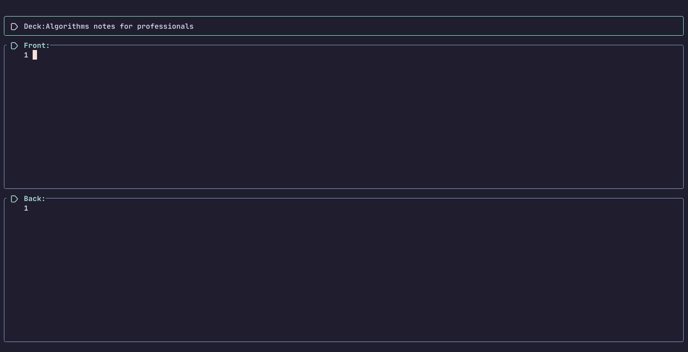

# Ankifill



Ankifill is a Neovim plugin that allows you to create Anki cards directly from your editor.

## Features

- Create Anki cards without leaving Neovim.
- Support for multiple decks and note types.
- Edit card content using Html.
- Easy image insertion.
- Format code blocks within cards.
- Save cards directly to Anki using AnkiConnect.

## Installation

Add the following to your Neovim configuration:

### Using [lazy.nvim](https://github.com/folke/lazy.nvim):

```lua
{
  "superb00y/ankifill",
  dependencies = { "nvim-lua/plenary.nvim" },
}
```

## Configuration

Here's an example configuration:

```lua
{
  "superb00y/ankifill",
  dependencies = { "nvim-lua/plenary.nvim" },
  config = function()
    require("ankifill").setup({
      default_deck = "Default",
      default_model = "Basic",
      image_dir = "",
      image_formatting = function(text)
        return string.format('<div style="text-align: center;"></div>', text)
      end,
      text_formatting = {},
      code_formatters = function(code)
        return string.format("<pre>%s</pre>", code)
      end,
    })
  end,
}
```

## Usage

- To start creating a new Anki card, use the command `:Anki`.
- Ankifill provides the following keybindings by default:

| Keybinding   | Description             |
| ------------ | ----------------------- |
| `<leader>nk` | Go to previous field    |
| `<leader>nj` | Go to next field        |
| `<leader>ns` | Save card               |
| `<leader>nr` | Reset editor            |
| `<leader>ni` | Paste image             |
| `<leader>ng` | Send to Anki GUI        |
| `<leader>no` | Open Anki deck overview |
| `<leader>nf` | Reset fields            |
| `<leader>nl` | Lock current field      |
| `<leader>nu` | Unlock field            |

### Recommended Plugins

Consider using:

1. [nvim-treesitter](https://github.com/nvim-treesitter/nvim-treesitter) for better syntax highlighting
2. [which-key.nvim](https://github.com/folke/which-key.nvim) for keybinding hints
3. [icon-picker.nvim](https://github.com/ziontee113/icon-picker.nvim) for symbol insertion

## TODO

Here's what am planning for future releases of AnkiFill:

- [ ] Support for cloze deletions
- [ ] Custom card templates
- [ ] Support for audio attachments
- [ ] Better image preview and insertion
- [ ] Custom keybindings

## Contributing

Contributions are more than welcome! Please feel free to submit a Pull Request.

## License

This project is licensed under the MIT License - see the [LICENSE](LICENSE) file for details.
